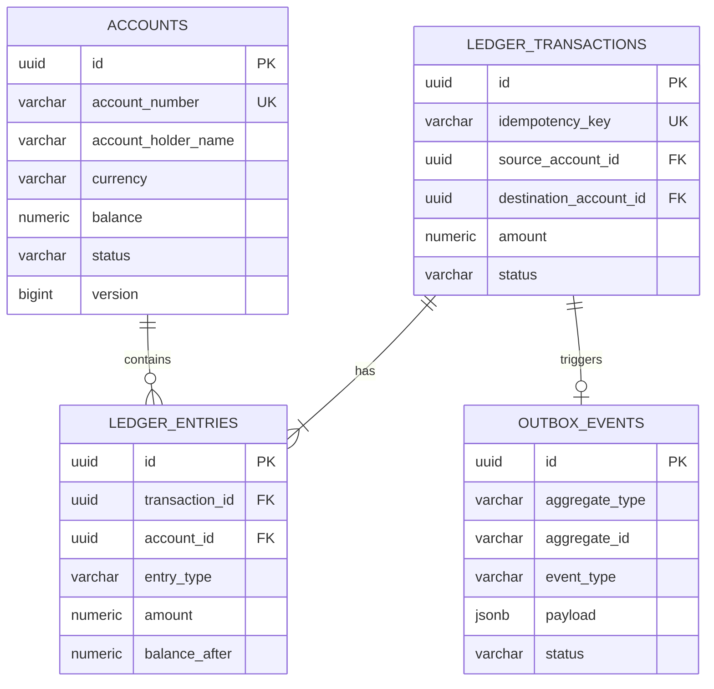

# HydraPay Database & Double-Entry Ledger Design

## Overview
HydraPay utilizes PostgreSQL 16 as its primary ACID storage engine. The ledger schema enforces **strict double-entry bookkeeping** where no money is ever created or destroyed out of thin air.

---

## Entity Relationship (ER) Diagram

---

## Double-Entry Invariant Rule

For every financial transfer committed in `ledger_transactions`, exactly two entries are recorded in `ledger_entries`:
1. **DEBIT Entry**: Applied to the Source Account ($\text{Amount} < 0$).
2. **CREDIT Entry**: Applied to the Destination Account ($\text{Amount} > 0$).

### Mathematical Proof of Balance Invariant
For any given transaction $T$:

$$\sum_{e \in \text{Entries}(T)} \text{Amount}(e) = \text{DebitAmount} + \text{CreditAmount} = (-A) + (+A) = 0$$

Across all ledger entries in the entire database:

$$\sum_{\text{All Entries}} \text{Amount} = 0$$

This mathematical balance invariant guarantees that total assets and total liabilities across the system remain perfectly net-zero at all times.

---

## High-Throughput Indexing Strategy

To support 10,000+ TPS query execution:

1. **`accounts(account_number)`**: B-Tree index for fast account lookup.
2. **`ledger_transactions(idempotency_key)`**: Unique Index for Tier 2 DB idempotency fallback checks.
3. **`outbox_events(status, created_at) WHERE status = 'PENDING'`**: Partial Index optimization for instant outbox polling without table scans.
