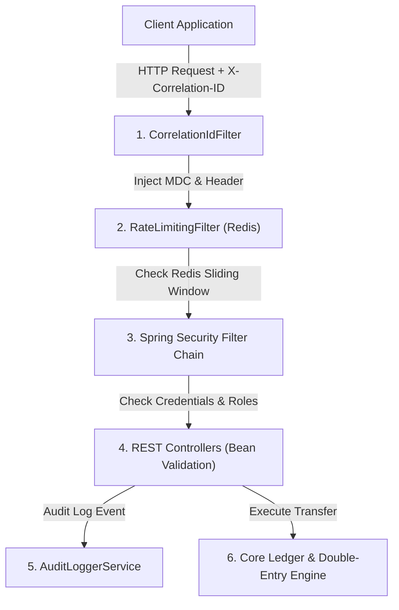

# HydraPay Production Security & API Hardening Guide

## Overview
This document details the security architecture, threat model, API protection layers, authorization controls, and compliance guidelines for **HydraPay**.

---

## 1. Security Architecture Topology



---

## 2. Authentication & Authorization Model

### Security Roles
- `ROLE_ADMIN`: Full administrative control (reconciliation, management actuator endpoints, all ledger read/write operations).
- `ROLE_OPERATOR`: Operational financial capabilities (initiating transfers, viewing accounts and transaction histories).
- `ROLE_READONLY`: Read-only access to ledger transaction histories, account balances, and system statistics.

### Route Authorization Matrix
| Endpoint Path | HTTP Method | Required Role | Public Access |
| :--- | :--- | :--- | :--- |
| `/actuator/health` | GET | None | **Yes (Public)** |
| `/actuator/metrics` | GET | `ROLE_ADMIN` | No |
| `/actuator/prometheus` | GET | `ROLE_ADMIN` | No |
| `/actuator/info` | GET | `ROLE_ADMIN` | No |
| `/api/v1/transfers` | POST | `ROLE_OPERATOR`, `ROLE_ADMIN` | No |
| `/api/v1/reconcile` | POST | `ROLE_ADMIN` | No |
| `/api/v1/accounts/**` | GET | `ROLE_READONLY`, `ROLE_OPERATOR`, `ROLE_ADMIN` | No |
| `/api/v1/transfers/**` | GET | `ROLE_READONLY`, `ROLE_OPERATOR`, `ROLE_ADMIN` | No |
| `/api/v1/stats` | GET | `ROLE_READONLY`, `ROLE_OPERATOR`, `ROLE_ADMIN` | No |

---

## 3. Distributed Rate Limiting

- **Engine**: Redis-backed sliding window rate limiter (`RateLimiterService`).
- **Configuration**:
  ```yaml
  hydrapay:
    rate-limit:
      enabled: true
      requests-per-second: 100
      burst: 200
  ```
- **Response Handling**: Rejects request flooding **before** database connection checkout or financial transaction open.
- **HTTP Response**: `429 TOO MANY REQUESTS` with JSON body:
  ```json
  {
    "timestamp": "2026-08-18T11:35:00Z",
    "status": 429,
    "error": "RATE_LIMIT_EXCEEDED",
    "message": "Too many requests. Rate limit exceeded.",
    "path": "/api/v1/transfers",
    "correlationId": "corr_7d1e99"
  }
  ```

---

## 4. Request Correlation & Distributed Tracing

- **Header**: `X-Correlation-ID`
- **Behavior**: Preserves incoming correlation header if supplied by gateway; generates UUID `X-Correlation-ID` if absent.
- **SLF4J MDC Integration**: Injected into `MDC.put("correlationId", correlationId)` so every application log statement includes the correlation context.
- **Header Reflection**: Guaranteed reflection in response headers and unified error payloads.

---

## 5. Input Validation & Defense in Depth

### TransferRequest DTO Rules
- `idempotencyKey`: `@NotBlank`, `@Size(min=1, max=128)`
- `sourceAccountId`: `@NotNull` (UUID)
- `destinationAccountId`: `@NotNull` (UUID)
- `amount`: `@NotNull`, `@Positive`, `@DecimalMin("0.01")` (`BigDecimal`)
- `currency`: `@NotBlank`, `@Pattern(regexp = "^[A-Z]{3}$")`
- `description`: `@Size(max=255)`
- `isDifferentAccounts()`: Custom `@AssertTrue` validation ensuring `sourceAccountId != destinationAccountId`.

---

## 6. Idempotency Security & Payload Conflict Guard

- **Payload Conflict Detection**: If an `idempotencyKey` is resubmitted with a differing request payload hash:
  - System raises `IdempotencyConflictException`.
  - Returns HTTP `409 CONFLICT`.
  - Prevents financial key reuse attacks or payload tampering under identical idempotency keys.

---

## 7. Actuator & Sensitive Endpoint Protection

- Environment variables, database credentials, secrets, and raw internal states are strictly hidden.
- Sensitive endpoints (`/actuator/metrics`, `/actuator/prometheus`, `/actuator/info`) require `ROLE_ADMIN`.
- Health check `/actuator/health` exposes top-level status without leaking internal database passwords or connection URLs.

---

## 8. Audit Logging & Security Event Matrix

Structured audit logs are emitted via `AuditLoggerService` without exposing passwords or raw authorization tokens:

| Audit Event | Logged Metadata |
| :--- | :--- |
| `TRANSFER_REQUESTED` | `correlationId`, `idempotencyKey`, `sourceAccountId`, `destAccountId`, `amount`, `currency` |
| `TRANSFER_SUCCEEDED` | `correlationId`, `txId`, `idempotencyKey`, `sourceAccountId`, `destAccountId`, `amount` |
| `TRANSFER_FAILED` | `correlationId`, `idempotencyKey`, `reason` |
| `INSUFFICIENT_FUNDS` | `correlationId`, `sourceAccountId`, `requestedAmount` |
| `IDEMPOTENCY_CONFLICT` | `correlationId`, `idempotencyKey`, `reason` |
| `AUTH_FAILURE` | `correlationId`, `username`, `path`, `reason` |
| `ACCESS_DENIED` | `correlationId`, `username`, `path`, `requiredRole` |
| `RECONCILIATION_DISCREPANCY` | `correlationId`, `discrepancyCount`, `totalAccountsAudited` |
